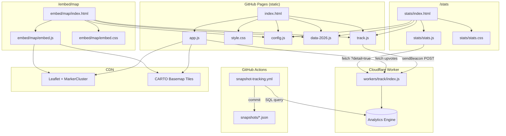

# SB Sandwich Week 2026 Map

A config-driven interactive map for food week events. Burger week, sandwich week, coffee week — change `config.js` and you're done.

**Built with:** Leaflet, vanilla JS/CSS, GitHub Pages, Cloudflare Workers (optional)

**Live examples:**
- [SB Burger Week](https://sbburgerweekmap.com) — the original
- [SB Coffee Week](https://sbcoffeeweekmap.com)

---

## Quick Start

1. Click **"Use this template"** on GitHub to create your event repo
2. Edit `config.js` — set event name, dates, emoji, domain
3. Copy `data-template.js` to `data-YYYY.js` and add your restaurants
4. Run `python3 apply-theme.py`
5. Enable GitHub Pages → deploy from main branch

## Staying in Sync

Pull future template improvements into your event repo:

```bash
git remote add template https://github.com/samgutentag/sbfoodweek-template.git
git fetch template
git merge template/main
# config.js will conflict — keep your values
```

---

## Complete Setup Guide

Running a food event in your city? This guide walks you through every step from zero to a fully deployed site.

We'll use **"SB Burrito Week"** as the running example throughout.

### What You'll End Up With

- An interactive map with search, filters, and directions
- A shareable embed for local news sites and blogs
- A live stats dashboard with per-restaurant engagement scores
- Optional: click tracking, restaurant hours, daily data snapshots

### What You'll Need

| Tool | Required? | What For |
|------|-----------|----------|
| Git + GitHub account | Yes | Hosting via GitHub Pages |
| Python 3 | Yes | `apply-theme.py` and data scripts |
| ImageMagick | Yes | Social preview image generation |
| A text editor | Yes | Editing config and data files |
| Cloudflare account (free) | Optional | Web analytics + click tracking |
| Google Cloud account (free tier) | Optional | Restaurant hours feature |
| Wrangler CLI (npm) | Optional | Deploying the tracking Worker |
| Custom domain | Optional | Nicer URL than `username.github.io` |

---

### Step 1: Fork, Clone, and Run Locally

```bash
# Fork on GitHub, then:
git clone https://github.com/YOUR_USERNAME/YOUR_REPO.git
cd YOUR_REPO
python3 -m http.server 8000 --bind 127.0.0.1
# Open http://localhost:8000
```

You'll see the template map with example data. A local server is required — `file://` won't work because scripts load via relative paths.

To test with skeleton data (no menu details), add `?year=9999` to the URL.

---

### Step 2: Install ImageMagick

```bash
# macOS
brew install imagemagick

# Ubuntu/Debian
sudo apt-get install imagemagick

# Verify
magick --version
```

ImageMagick is used by `apply-theme.py` to generate the social preview PNG (`og-image.png`). If it's missing, the script will warn but continue — the SVG will still be updated, but you won't get a PNG.

---

### Step 3: Configure Your Theme

Edit `config.js` — this is the single source of truth for your event. Every field has a comment explaining what it does.

```js
const THEME = {
  // Event identity
  eventName: "SB Burrito Week 2026",
  eventDates: "Mar 5–11",
  emoji: "🌯",

  // OG image text (two lines for the social preview image)
  ogLine1: "Santa Barbara",
  ogLine2: "Burrito Week 2026",

  // Labels (what to call the featured item)
  itemLabel: "burrito",
  itemLabelPlural: "burritos",

  // Site URL (used for OG meta tags, embed snippets, print page)
  siteUrl: "https://sbburritoweekmap.com",

  // Description (used for meta tags)
  description: "Interactive map of all participating restaurants. Search, filter by area, and get directions.",

  // Source article link shown in header and About modal
  sourceLabel: "Source: The Independent",
  sourceUrl: "https://example.com/burrito-week-article",

  // Venmo tip jar (set venmoUser to null to hide the tip jar entirely)
  venmoUser: "yourusername",
  venmoNote: "Buy me a burrito?",

  // Tip jar tiers — size: "s" (custom emoji), "m" (half theme emoji), "l" (full theme emoji)
  // The "m" tier gets an orange featured border. Tracking events: tip-s, tip-m, tip-l
  tipTiers: [
    { size: "s", label: "Side of Chips", emoji: "🫔", amount: 1 },
    { size: "m", label: "Half a Burrito", amount: 5 },
    { size: "l", label: "Full Burrito", amount: 10 },
  ],

  // LocalStorage namespace (unique per event to avoid collisions)
  storageKey: "sbburritoweek-checklist",

  // Print page
  printTitle: "SB Burrito Week 2026 — My Picks",

  // Event start/end dates — used for analytics time filters and concluded banner
  eventStartDate: "2026-03-05",
  eventEndDate: "2026-03-11",

  // Map center and zoom level
  mapCenter: [34.42, -119.7],
  mapZoom: 13,

  // GitHub repo URL (used in About modal and footer)
  githubRepoUrl: "https://github.com/YOUR_USERNAME/YOUR_REPO",

  // Data launch date — before this date, data.js (skeleton) loads.
  // On or after this date, data-<year>.js (full menu details) loads.
  // Set null to always load full data.
  dataLiveDate: "2026-03-04",

  // Event tracking — Cloudflare Worker URL (null to disable, set up in Step 8)
  trackUrl: null,

  // Cloudflare Web Analytics (null to disable, set up in Step 7)
  cfAnalyticsToken: null,

  // Contact email domain — auto-generates sb{itemLabel}week{year}@{domain}
  // Set null to hide the contact link in the About modal
  contactDomain: "example.com",

  // Google Places API key — documentation only, actual key goes in GitHub Secrets
  googlePlacesApiKey: null,
};
```

#### Config Field Reference

| Field | Type | Description |
|-------|------|-------------|
| `eventName` | string | Event title in header, about modal, OG tags |
| `eventDates` | string | Date range shown in header (e.g. "Mar 5–11") |
| `emoji` | string | Emoji for favicon, markers, popups, random picker |
| `ogLine1` / `ogLine2` | string | Two-line text for the social preview image |
| `itemLabel` / `itemLabelPlural` | string | What to call the menu item ("burrito" / "burritos") |
| `siteUrl` | string | Full URL for OG tags, share links, embed snippets |
| `description` | string | Meta description for search engines |
| `sourceLabel` / `sourceUrl` | string | Source article link text and URL |
| `venmoUser` | string \| null | Venmo username for tip jar. `null` hides it entirely |
| `venmoNote` | string | Pre-filled Venmo payment note |
| `tipTiers` | array | Tip jar tiers with size (s/m/l), label, emoji, amount |
| `storageKey` | string | localStorage key for favorites (unique per event) |
| `printTitle` | string | Title on the printable picks page |
| `eventStartDate` | string | ISO date for analytics time filters |
| `eventEndDate` | string \| null | ISO date for concluded banner. `null` to never show |
| `mapCenter` | [lat, lng] | Starting map coordinates |
| `mapZoom` | number | Starting zoom level (higher = more zoomed in) |
| `githubRepoUrl` | string | GitHub repo URL for About modal and footer |
| `dataLiveDate` | string \| null | ISO date to gate full data. `null` to always show |
| `trackUrl` | string \| null | Cloudflare Worker URL. `null` disables tracking |
| `cfAnalyticsToken` | string \| null | Cloudflare Web Analytics token. `null` disables it |
| `contactDomain` | string \| null | Domain for contact email. `null` hides the link |

---

### Step 4: Add Your Restaurant Data

Edit `data.js` (skeleton) and create `data-YYYY.js` (full details, where YYYY is your event year). Both files use the same format.

#### Update Area Colors

At the top of each data file, define your geographic areas and their marker colors:

```js
const AREA_COLORS = {
  "Downtown": "#e63946",
  "Westside": "#457b9d",
  "Eastside": "#2a9d8f",
  "Midtown": "#e9c46a",
};
```

#### Add Restaurants

```js
const restaurants = [
  {
    name: "El Taco Loco",
    address: "123 State St, Santa Barbara, CA 93101",
    area: "Downtown",           // Must match an AREA_COLORS key
    lat: 34.4208,
    lng: -119.6982,
    mapUrl: "https://maps.app.goo.gl/...",       // Google Maps link
    appleMapsUrl: "https://maps.apple.com/...",   // or null
    website: "https://eltacoloco.com",            // or null
    phone: "805-555-1234",                        // or null
    instagram: "eltacoloco",                      // handle only, no @. or null
    vegetarian: true,                             // dietary tag flags
    glutenFree: false,
    hasFries: false,
    menuItems: [
      { name: "The Monster Burrito", description: "Carne asada, beans, rice, guac, and salsa verde." },
      { name: "Veggie Supreme", description: null },  // null = "More details coming soon!"
    ],
  },
  // ... more restaurants
];
```

#### Tips for Getting Coordinates and Map Links

| What | How |
|------|-----|
| **Lat/Lng** | Google Maps → right-click the pin → "Copy coordinates" |
| **Google Maps link** (`mapUrl`) | Google Maps → click "Share" → copy link |
| **Apple Maps link** (`appleMapsUrl`) | Apple Maps → tap "Share" → copy link. Set `null` to use address-based directions |
| **Fallback Google Maps URL** | `https://www.google.com/maps/search/?api=1&query=Business+Name+123+Main+St+City+CA` — useful for quick data entry before collecting share links. `fetch-place-ids.py` resolves these to Place IDs correctly. |

#### Data Conventions

- Empty `menuItems: []` shows "Details coming soon!" in popup and sidebar
- `description: null` shows "More details coming soon!" for that specific item
- Multi-location restaurants get separate entries with suffixes: `"Mesa Burger (De La Vina)"`

---

### Step 5: Generate Assets

```bash
python3 apply-theme.py
```

This reads `config.js` and updates everything that can't read the config at runtime:

| File | What Gets Updated |
|------|-------------------|
| `og-image.svg` | Event name, dates, emoji, domain |
| `og-image.png` | Rendered from SVG with Twemoji emoji composite |
| `CNAME` | Custom domain for GitHub Pages |
| `index.html` | Favicon emoji, title, header, concluded banner, analytics snippet |
| `embed/index.html` | Favicon emoji, showcase title |
| `embed/map/index.html` | Favicon emoji, embed bar title, full map link, contact email |
| `stats/index.html` | Favicon emoji, page title, concluded banner |
| `README.md` | Hits badge domain, embed snippet, title |
| `workers/track/index.js` | Event start date in SQL queries |
| `.github/workflows/snapshot-tracking.yml` | Event start date in SQL queries |

**Run this every time you change `config.js`.**

> **If forking:** Delete `tracking-snapshot.js` if it exists in the repo root. This file contains baked-in stats data from the previous event and will cause the stats page to show stale data. It gets regenerated automatically by the snapshot workflow during your event.

---

### Step 6: Deploy to GitHub Pages

1. Go to your repo on GitHub → **Settings** → **Pages**
2. Under "Source", select **Deploy from a branch**
3. Select **main** branch → **/ (root)** → click **Save**
4. Wait 1–2 minutes. Your site is live at `https://YOUR_USERNAME.github.io/YOUR_REPO/`

At this point you have a working map. Everything below is optional.

---

### Step 7: Custom Domain (Optional)

If you want a clean URL like `sbburritoweekmap.com` instead of `username.github.io/YOUR_REPO`.

#### 7a. Buy a Domain

Any registrar works (Namecheap, Cloudflare, Google Domains, etc).

#### 7b. Set Up DNS

Add these records at your DNS provider (pointing to GitHub Pages):

| Type | Name | Value |
|------|------|-------|
| A | @ | 185.199.108.153 |
| A | @ | 185.199.109.153 |
| A | @ | 185.199.110.153 |
| A | @ | 185.199.111.153 |
| CNAME | www | YOUR_USERNAME.github.io |

#### 7c. Configure GitHub Pages

1. In your repo → **Settings** → **Pages** → **Custom domain**
2. Enter your domain (e.g. `sbburritoweekmap.com`) and click **Save**
3. Check **Enforce HTTPS** once the DNS check passes (may take up to 24 hours)

The `CNAME` file in your repo is auto-updated by `apply-theme.py` from `config.js` → `siteUrl`.

> **Cloudflare DNS users:** You **must** set the proxy status to **OFF** (grey cloud icon) for all DNS records pointing to GitHub Pages. If the orange cloud (proxy) is on, GitHub can't issue an SSL certificate via Let's Encrypt, and your site will have HTTPS errors.

---

### Step 8: Cloudflare Web Analytics (Optional)

Free, cookieless, privacy-friendly page view analytics. No tracking Worker required.

1. Create a free [Cloudflare account](https://dash.cloudflare.com/sign-up) (if you don't have one)
2. Go to **Web Analytics** in the sidebar → **Add a site**
3. Enter your domain → copy the **token** (a hex string like `f1a2b3c4d5e6f7g8h`)
4. Paste it in `config.js`:
   ```js
   cfAnalyticsToken: "f1a2b3c4d5e6f7g8h",
   ```
5. Run `python3 apply-theme.py` — this injects the analytics snippet into `index.html`
6. Commit and push

The token is public (it's in client-side JS). Setting it to `null` removes the snippet entirely.

---

### Step 9: Click Tracking + Stats Dashboard (Optional)

This powers the `/stats` leaderboard and tracks per-restaurant engagement (views, directions, shares, etc). It uses a Cloudflare Worker writing to Analytics Engine (free tier: 100k writes/day, 10k reads/query, 90-day retention).

#### 9a. Install Wrangler

```bash
npm install -g wrangler
wrangler login
```

This opens a browser window to authenticate with your Cloudflare account.

#### 9b. Create an Analytics Engine Dataset

1. In the [Cloudflare dashboard](https://dash.cloudflare.com), go to **Workers & Pages** → **Analytics Engine**
2. Click **Create a dataset**
3. Name it something like `sbburritoweek`
4. Note the dataset name — you'll need it for `wrangler.toml`

#### 9c. Get Your Cloudflare Account ID

1. Go to the Cloudflare dashboard home page
2. Your **Account ID** is in the right sidebar (or URL: `dash.cloudflare.com/<ACCOUNT_ID>/...`)
3. Copy it

#### 9d. Configure the Worker

Edit `workers/track/wrangler.toml`:

```toml
name = "sbburritoweek-track"
main = "index.js"
compatibility_date = "2024-01-01"

[vars]
ACCOUNT_ID = "YOUR_CLOUDFLARE_ACCOUNT_ID"

[[analytics_engine_datasets]]
binding = "TRACKER"
dataset = "sbburritoweek"
```

You can remove the `RUM_SITE_TAG` line if you don't plan to use Cloudflare RUM (Browser Insights).

#### 9e. Create an API Token

1. Cloudflare dashboard → **My Profile** (top-right) → **API Tokens** → **Create Token**
2. Use "Custom token" with these permissions:
   - **Account** → **Analytics Engine** → **Read**
   - **Account** → **Workers Scripts** → **Edit**
3. Scope it to your account only
4. Copy the token

#### 9f. Add Worker Secrets

```bash
cd workers/track
wrangler secret put CF_API_TOKEN
# Paste your Cloudflare API token when prompted

wrangler secret put ADMIN_TOKEN
# Choose a password for the /admin search query viewer
```

The `ADMIN_TOKEN` protects the `/admin` page, which shows what users are searching for during the event. Pick any password — you'll enter it at `yoursite.com/admin` to view the data.

#### 9g. Update the Event Start Date in the Worker

Open `workers/track/index.js` and find all lines with:
```sql
WHERE timestamp >= toDateTime('2026-02-19 09:00:00')
```

Change the date to your event start date in UTC. (`apply-theme.py` does this automatically if you've already set `eventStartDate` in config.js and run the script.)

#### 9h. Enable Event Writes

In `workers/track/index.js`, find the POST handler. If there's an early `return` near the top that short-circuits writes (added when winding down the previous event), remove it and uncomment the `writeDataPoint` call.

#### 9i. Deploy the Worker

```bash
cd workers/track
wrangler deploy
```

Wrangler prints the Worker URL, something like:
```
https://sbburritoweek-track.YOUR_SUBDOMAIN.workers.dev
```

#### 9j. Enable Tracking in config.js

```js
trackUrl: "https://sbburritoweek-track.YOUR_SUBDOMAIN.workers.dev",
```

Run `python3 apply-theme.py`, commit, and push.

#### 9k. Verify

1. Open your site and click on a restaurant popup
2. Run `wrangler tail` in another terminal — you should see POST requests logging
3. Visit `/stats` — the leaderboard should start populating

#### What Gets Tracked

| Action | When | Label |
|--------|------|-------|
| `view` | Popup opened (map or sidebar click) | Restaurant name |
| `sidebar-view` | Sidebar item scrolled into view | Restaurant name |
| `directions-apple` | Apple Maps link clicked | Restaurant name |
| `directions-google` | Google Maps link clicked | Restaurant name |
| `website` | Website link clicked | Restaurant name |
| `phone` | Phone link clicked | Restaurant name |
| `instagram` | Instagram link clicked | Restaurant name |
| `share` | Share button clicked | Restaurant name |
| `upvote` / `un-upvote` | Like button toggled | Restaurant name |
| `deeplink` | Arrived via URL hash (#slug) | Restaurant name |
| `filter-area` | Area filter button clicked | Area name |
| `filter-tag` | Dietary tag filter clicked | Tag name |
| `filter-hours` | Hours filter clicked | Filter type |
| `tip-s` / `tip-m` / `tip-l` | Tip jar tier clicked | "tip-jar" |
| `tip-share` | Tip jar share clicked | "tip-jar" |
| `stats-view` | Stats page loaded | "stats" |

---

### Step 10: Tracking Data Snapshots (Optional)

Cloudflare Analytics Engine only retains data for 90 days. This GitHub Action snapshots your tracking data daily and commits it to the repo as JSON files.

**Prerequisites:** You need the tracking Worker from Step 9 deployed and working.

#### 10a. Add GitHub Repo Secrets

Go to your repo → **Settings** → **Secrets and variables** → **Actions** → **New repository secret**:

| Secret Name | Value |
|-------------|-------|
| `CF_ACCOUNT_ID` | Your Cloudflare Account ID (from Step 9c) |
| `CF_API_TOKEN` | Your API token (from Step 9e) |

#### 10b. Configure the Workflow

Edit `.github/workflows/snapshot-tracking.yml`:

1. **Uncomment the schedule block:**
   ```yaml
   schedule:
     # Hourly during event week — adjust date range for next event
     - cron: "0 * 5-14 3 *"   # Mar 5–14, hourly
   ```

2. **Update the SQL timestamp filters** (two places in the inline Python script):
   ```sql
   WHERE timestamp >= toDateTime('2026-03-05 09:00:00')
   ```

3. **Update the dataset name** in the SQL queries if you changed it:
   ```sql
   FROM sbburritoweek
   ```

4. Commit and push. The workflow also supports **manual dispatch** from the Actions tab.

Snapshots are saved to `snapshots/tracking-YYYY-MM-DD.json`.

---

### Step 11: Restaurant Hours (Optional)

Show today's hours in popups, open/closed badges in the sidebar, and "Open Now" / "Lunch" / "Dinner" filter buttons. Uses the Google Places API via a daily GitHub Action.

The free tier gives you $200/month in credit, which covers roughly 6,600 Place Details requests — more than enough for daily updates of ~50 restaurants.

#### 11a. Create a Google Cloud Project

1. Go to [console.cloud.google.com](https://console.cloud.google.com)
2. Create a new project (e.g. "Burrito Week Map")
3. Go to **APIs & Services** → **Library** → search "Places API" → **Enable**

#### 11b. Create an API Key

1. **APIs & Services** → **Credentials** → **Create Credentials** → **API Key**
2. Click **Edit** on the new key → under "API restrictions", select **Restrict key** → choose **Places API** only
3. Copy the key

#### 11c. Add as GitHub Secret

Go to your repo → **Settings** → **Secrets and variables** → **Actions** → **New repository secret**:

| Secret Name | Value |
|-------------|-------|
| `GOOGLE_PLACES_API_KEY` | Your API key |

#### 11d. Generate Place IDs (One-Time)

This script resolves your Google Maps links to stable Place IDs:

```bash
GOOGLE_PLACES_API_KEY=your_key python3 fetch-place-ids.py
```

- Reads `mapUrl` from your data file
- Calls the Find Place API to get Place IDs (format: `ChIJ...`)
- Falls back to following redirect URLs and extracting the ID from the expanded URL
- Writes `place-ids.json`

Spot-check a few entries, then commit `place-ids.json`.

#### 11e. Generate Initial Hours

```bash
GOOGLE_PLACES_API_KEY=your_key python3 fetch-hours.py
```

- Reads `place-ids.json`
- Calls the Places Details API (`fields=opening_hours`) for each restaurant
- Writes `hours.json` with periods, lunch/dinner flags

Verify `hours.json` looks correct, then commit it.

#### 11f. Enable the Daily Workflow

Edit `.github/workflows/fetch-hours.yml`:

1. **Uncomment the schedule block:**
   ```yaml
   schedule:
     # Daily at 6am PT (13:00 UTC) — adjust date range for next event
     - cron: "0 13 3-14 3 *"   # Mar 3–14 (2 days before through 3 days after)
   ```

2. Commit and push. The workflow runs daily, fetches fresh hours, and auto-commits `hours.json` if anything changed.

**Graceful degradation:** If `hours.json` is missing or fails to load, the hours features simply don't appear. Everything else works normally.

---

### Step 12: Embed (Optional)

The map can be embedded on other websites via an iframe. A showcase page at `/embed` has copy-paste instructions.

```html
<iframe
  src="https://sbsandwichweekmap.com/embed/map"
  width="100%"
  height="600"
  style="border: none; border-radius: 8px;"
  title="SB Sandwich Week 2026 Interactive Map"
  loading="lazy"
  allowfullscreen
></iframe>
```

The embed lives in `embed/map/` and has its own `embed.js` and `embed.css`. It shares `config.js` and data files with the main site via relative paths (`../../`), but **changes to `app.js` or `style.css` do NOT propagate to the embed**. If you add a feature to the main map that should also appear in the embed, you need to implement it in `embed/map/embed.js` separately.

| | Main Site | Embed |
|---|-----------|-------|
| Sidebar width | 360px | 280px |
| Mobile breakpoint | 768px | 600px |
| JS | `app.js` | `embed/map/embed.js` |
| CSS | `style.css` | `embed/map/embed.css` |
| Header | Full header with nav | Compact bar with "Open full map" link |

---

### Step 13: Venmo QR Code (Optional)

The tip jar modal shows a QR code that links to your Venmo profile. Replace `venmo_qr.png` in the repo root with your own Venmo QR code image:

1. Open Venmo → tap your profile → **Scan to Pay** → screenshot or save the QR code
2. Save as `venmo_qr.png` in the repo root (any square image works)

The QR code in the HTML also uses a dynamically generated one from `api.qrserver.com` — both are displayed.

---

## Event Day Checklist

### Activating for Your Event

1. Finalize `config.js` (all fields, especially `trackUrl`, `cfAnalyticsToken`, `dataLiveDate`)
2. Run `python3 apply-theme.py`
3. Populate `data-YYYY.js` with full restaurant data and menu items
4. Uncomment cron schedules in `.github/workflows/fetch-hours.yml` and `snapshot-tracking.yml`
5. Enable Worker writes in `workers/track/index.js` (remove early return, uncomment `writeDataPoint`)
6. Deploy Worker: `cd workers/track && wrangler deploy`
7. Commit and push everything
8. Verify: site loads, `/stats` shows data, tracking events appear in `wrangler tail`

### Winding Down After Your Event

1. Run a final snapshot: go to **Actions** tab → **Snapshot Tracking Data** → **Run workflow**
2. Snapshot hourly data for the stats dashboard charts (do this **before** disabling `trackUrl`):
   ```bash
   ./snapshot-hourly.sh
   git add snapshots/hourly-events.json snapshots/hourly-labels.json
   ```
   This fetches hourly action data and per-filter-label data from the Worker, scoped to your event dates from `config.js`. The stats page loads these files automatically when the event is concluded — no more Worker calls needed for charts.
3. Set `trackUrl: null` and `cfAnalyticsToken: null` in `config.js`
4. Run `python3 apply-theme.py`
5. Comment out cron schedules in both workflow files
6. Add early return + comment out `writeDataPoint` in `workers/track/index.js`
7. Deploy Worker: `cd workers/track && wrangler deploy`
8. Commit and push

---

## Run Locally

```bash
python3 -m http.server 8000 --bind 127.0.0.1
```

Open [http://localhost:8000](http://localhost:8000). Add `?year=9999` to test with skeleton data.

---

## Architecture



---

## File Structure

```
your-food-week/
├── index.html              # Main page shell (OG tags, favicon, analytics)
├── app.js                  # Map logic, sidebar, filtering, search, deep linking
├── style.css               # All styles including mobile responsive layout
├── config.js               # Theme config — edit this to rebrand
├── data.js                 # Restaurant data skeleton (empty menuItems)
├── data-2026.js            # Production data with full menuItems
├── track.js                # sendBeacon tracker (reads THEME.trackUrl)
├── apply-theme.py          # Generates OG image, updates CNAME/HTML/README
├── og-image.svg            # Social preview image (source)
├── og-image.png            # Social preview image (generated)
├── venmo_qr.png            # Venmo QR code
├── CNAME                   # Custom domain for GitHub Pages
├── snapshot-hourly.sh      # One-time: snapshot hourly data for concluded event stats
├── fetch-place-ids.py      # One-time Place ID lookup from mapUrl redirects
├── place-ids.json          # Restaurant name → Google Place ID mapping
├── fetch-hours.py          # Daily hours fetch from Google Places API
├── hours.json              # Operating hours data (committed, updated daily)
│
├── snapshots/              # Tracking data snapshots (auto-committed)
│   ├── tracking-YYYY-MM-DD.json   # Daily aggregate snapshots
│   ├── hourly-events.json         # Hourly action counts (created by snapshot-hourly.sh)
│   └── hourly-labels.json         # Hourly per-filter-label counts (created by snapshot-hourly.sh)
│
├── embed/
│   ├── index.html          # Embed showcase page (/embed)
│   └── map/
│       ├── index.html      # Embeddable map page (/embed/map)
│       ├── embed.js        # Self-contained map logic (separate from app.js)
│       └── embed.css       # Compact styles (280px sidebar)
│
├── stats/
│   ├── index.html          # Stats dashboard page (/stats)
│   ├── stats.js            # Fetches ?detail=true, renders leaderboard
│   └── stats.css           # Dashboard styles
│
├── .github/workflows/
│   ├── fetch-hours.yml     # Daily Google Places hours fetch
│   └── snapshot-tracking.yml  # Daily tracking data snapshot
│
└── workers/track/
    ├── index.js            # Cloudflare Worker (POST + GET endpoints)
    ├── wrangler.toml       # Worker config (binding, dataset, account ID)
    └── pull-data.sh        # Utility: dump all tracking events as JSON
```

---

## Data Format

Each restaurant in `data.js` / `data-2026.js`:

```js
{
  name: "Mesa Burger (De La Vina)",
  address: "2032 De La Vina St, Santa Barbara, CA 93105",
  area: "Other SB",
  lat: 34.4368,
  lng: -119.7210,
  mapUrl: "https://maps.app.goo.gl/...",
  appleMapsUrl: "https://maps.apple.com/place?...",  // or null
  website: "https://mesaburger.com",                 // or null
  phone: "805-963-1346",                             // or null
  instagram: "mesaburger",                           // or null (handle only, no @)
  vegetarian: true,
  glutenFree: false,
  hasFries: true,
  menuItems: [
    { name: "The Beast", description: "Double patty with house sauce." },
    { name: "Veggie Smash", description: null },     // null = "coming soon"
  ],
}
```

---

## Worker API

The Cloudflare Worker (`workers/track/index.js`) exposes these endpoints:

| Method | Params | Purpose | Response |
|--------|--------|---------|----------|
| POST | `/` | Record a tracking event | `"ok"` |
| GET | `/` | Per-restaurant action breakdown | `{name: {view: N, ...}}` |
| GET | `?upvotes=true` | Net upvote counts | `{name: N, ...}` |
| GET | `?hourly=true` | Hourly event breakdown (add `&start=YYYY-MM-DD&end=YYYY-MM-DD` to constrain date range, otherwise last 7 days) | `{hour: {action: N, ...}}` |
| GET | `?hourly=true&label=X` | Hourly counts for a specific label (supports `&start`/`&end`) | `{hour: N, ...}` |
| GET | `?rum=true` | Device/browser/OS stats | `{devices: {}, browsers: {}, os: {}}` |
| GET | `?active=true` | Recent visitors + actions | `{visitors1h: N, recentActions: N}` |
| GET | `?admin=true&token=X` | Top search queries, last 7 days (requires `ADMIN_TOKEN` secret) | `[{query, count}]` |

**POST body:** `{ "action": "view", "label": "Mesa Burger" }`

---

## Secrets Reference

### GitHub Repo Secrets

| Secret | Used By | Required For |
|--------|---------|--------------|
| `GOOGLE_PLACES_API_KEY` | `fetch-hours.yml` | Restaurant hours feature |
| `CF_ACCOUNT_ID` | `snapshot-tracking.yml` | Tracking data snapshots |
| `CF_API_TOKEN` | `snapshot-tracking.yml`, Worker | Tracking + snapshots |

### Cloudflare Worker Secrets

Set via `wrangler secret put <NAME>` from `workers/track/`.

| Secret | Required For |
|--------|--------------|
| `CF_API_TOKEN` | Worker reads from Analytics Engine (same token as GitHub secret) |
| `ADMIN_TOKEN` | Password for `/admin` search query viewer |

---

## Tech Stack

- **Map:** [Leaflet](https://leafletjs.com/) + [MarkerCluster](https://github.com/Leaflet/Leaflet.markercluster) + [CARTO](https://carto.com/) basemap tiles
- **Hosting:** GitHub Pages with custom domain
- **Tracking:** Cloudflare Worker + Analytics Engine (free tier)
- **Analytics:** Cloudflare Web Analytics (free, cookieless)
- **Hours:** Google Places API via GitHub Actions
- **Build:** None — plain HTML/CSS/JS, no npm, no bundler

## Issues & Feedback

Found a bug, missing restaurant, or wrong detail? [Open an issue](../../issues).

## Author

Made by [Sam Gutentag](https://www.gutentag.world) in Santa Barbara, CA.
